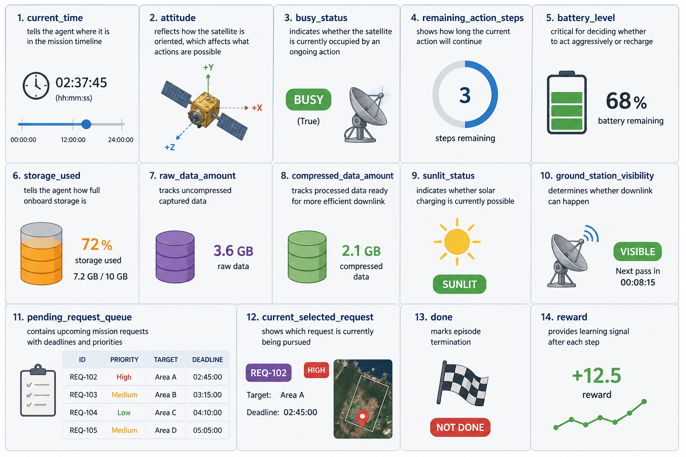
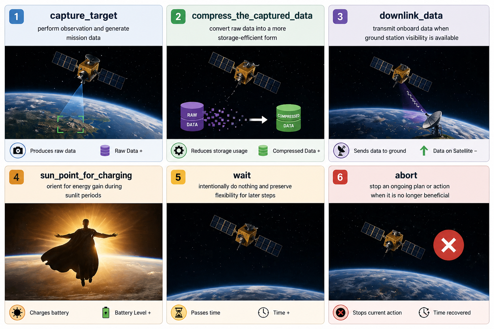
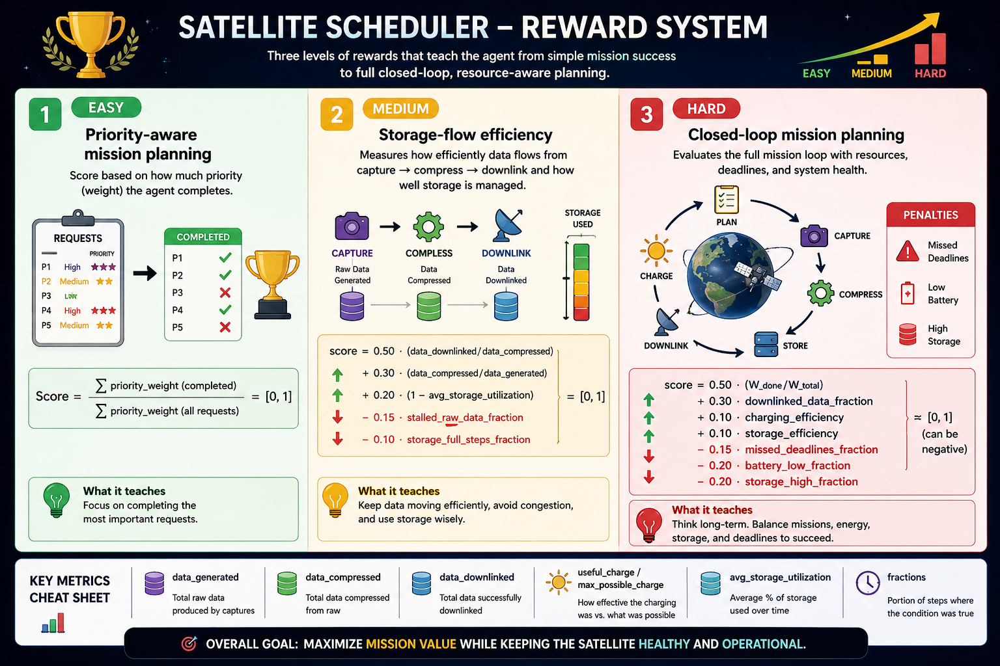
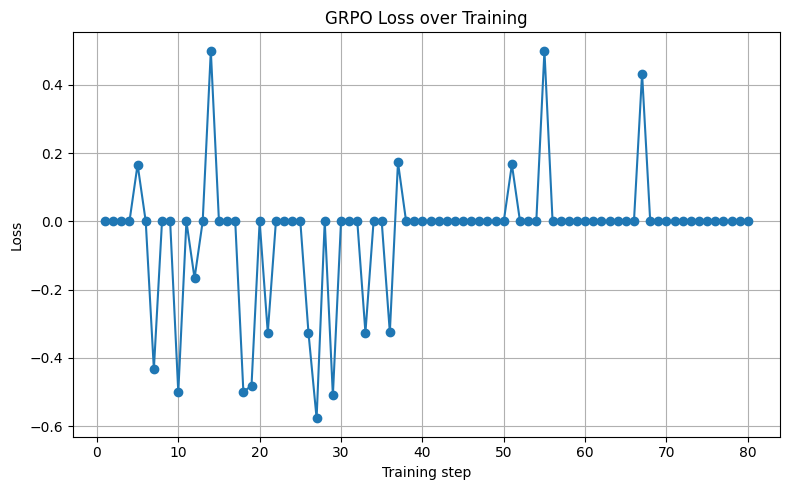
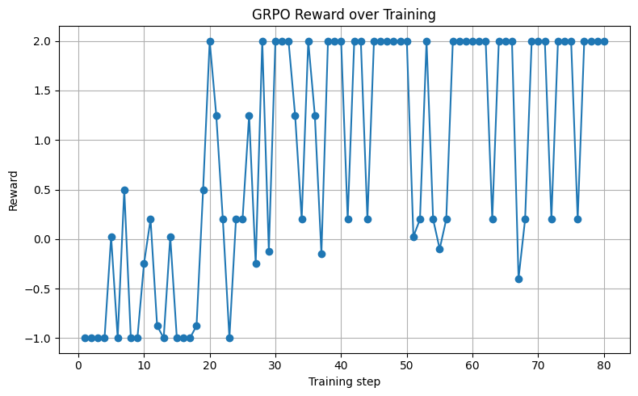
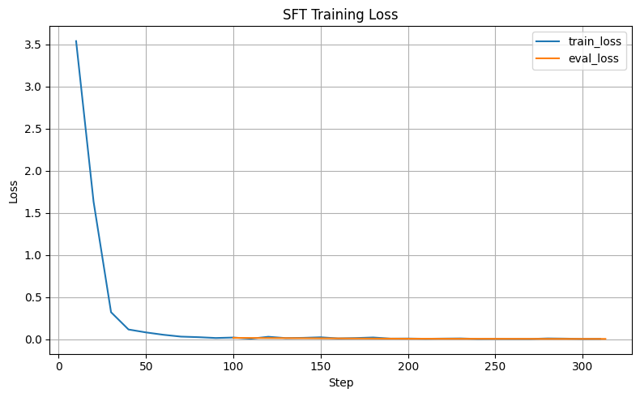
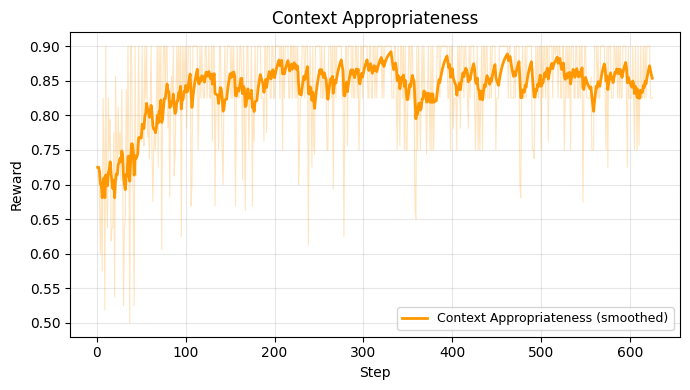
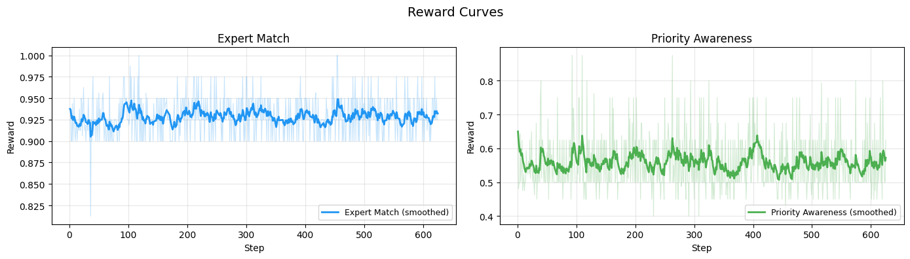
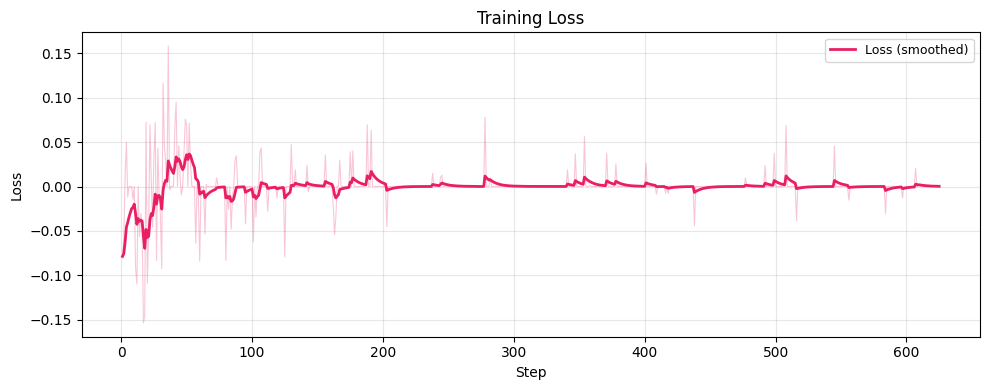

# Low-Earth-Orbit (LEO) Satellite Scheduling RL agent

## Problem Statement

Satellite scheduling is the problem of deciding what a satellite should do, when it should do it, and in what sequence. For an Earth observation satellite, this typically involves tasks such as capturing images, pointing toward specific targets, charging when exposed to sunlight, compressing onboard data, and downlinking that data to ground stations.

A satellite operates under a tight set of constraints:

- **Limited battery capacity**: every action drains the battery, and charging only works in sunlight.
- **Restricted onboard storage**: raw captured images consume significant space; if storage fills up, the mission stalls.
- **Intermittent ground-station visibility**: data can only be downlinked during brief orbital passes.
- **Eclipse periods**: the Sun, Earth, and satellite alignment creates windows where solar panels produce nothing.
- **Request deadlines**: every observation request has a deadline. Miss that window and the opportunity is gone.

Because of these constraints, the scheduler constantly faces trade-offs:

> *Should it capture an image now or wait for a higher-priority request that might arrive later? Should it downlink data immediately or reserve time for more imaging? Should it charge the battery now or risk running low later? Should it compress data now or keep the imaging pipeline free?*

This turns the problem into a **sequential decision-making challenge**. Optimizing one step at a time does not work because an action taken at the start of an episode can ripple through the entire timeline. Capturing an image now might consume storage needed later. Skipping a charging opportunity could prevent future operations. Missing a compression step might delay downlink much later. A poor early action can lead to missed deadlines several steps ahead.

---

## Environment

The environment exposes **12 key state variables** at every step, alongside additional variables such as `done` and `reward` used during training.

When the environment resets, the `pending_request_queue` starts empty. As the episode progresses, target requests are added randomly to simulate real-world unpredictability. Each request includes:

| Field | Description |
|-------|-------------|
| `request_id` | Unique identifier |
| `priority` | High, Medium, or Low |
| `arrival_time` | When the request appears |
| `deadline` | Time by which the task must be completed |
| `imaging_mode` | Resolution: high, medium, or low |

### Actions

At every step, the agent can choose from **six distinct actions**. Each action may span multiple steps depending on the current state and the type of request being processed.

For instance, if the satellite is already oriented toward the Sun and the agent selects the charging action, charging begins immediately (provided the satellite is in sunlight). If it is not oriented correctly, the satellite must first **slew** toward the Sun:

- Moving from a target to the Sun takes ~1.5 minutes (**3 steps**)
- Moving from a ground station to the Sun takes ~1 minute (**2 steps**)

Similarly, imaging duration depends on the resolution of the request, higher resolution tasks take more time. This variability adds another layer of complexity, especially since rewards are not immediate.

To handle sudden changes, an **abort action** is available. Imagine the agent has started processing a low-priority, high-resolution task. Suddenly, a new request arrives with the highest priority and a tight deadline. The agent can abort the current task, recover the remaining time, and redirect its effort toward the urgent request. Even then, it must consider the time required to slew between targets.

### Episode Structure

Each episode runs for **180 steps**, with each step representing **30 seconds** of real time. This means an episode spans **90 minutes**, which is sufficient to evaluate the agent's performance over a meaningful sequence of decisions.

The reward is computed based on the agent's performance over the entire episode, since early decisions influence outcomes much later in the sequence.

### Rewards

---

## Training

### Phase 1: Direct GRPO (Failed Attempt)

Initially, I directly trained the LLM model with GRPO on full episode data with fewer epochs. The results were poor:

- The **loss was highly fluctuating** and unstable
- The **reward was growing steadily** but with significant variance

### Phase 2: SFT Warm Start

I then used a dataset to do an initial warm start using **Supervised Fine-Tuning (SFT)** with Unsloth. The loss decreased steadily, providing a strong baseline for the model's output format, instead of generating excessive text, the model learned to generate **only what is needed**. I started evaluation from the 100th step.

### Phase 3: GRPO with Rule-Based Rewards

I loaded the pre-trained SFT model for GRPO training. However, I faced a major issue with calculating rewards for the entire episode:

- Training became **extremely slow** (~156 hours for full training)
- Querying the environment for each step was expensive
- **WebSocket connections timed out** or closed unexpectedly during long episodes
- Unsloth didn't support multiple GPU training

**Solution:** Instead of calculating rewards at the end of the episode, I wrote **rule-based reward functions** that score each step independently with no websocket environment interaction needed during training.

#### Reward Functions

| Reward Function | Question It Answers |
|----------------|---------------------|
| **Context Appropriateness** | Is the chosen action relevant to the current satellite state? (e.g., compress when raw data exists, charge when battery is low and sunlit) |
| **Expert Match** | Does the model's output match the expert (SFT) action for this state? |
| **Priority Awareness** | Is the agent targeting the highest-priority pending tasks? |

### Loss Curve

While the loss was initially completely random, it started **approaching zero** as the steps increased.

